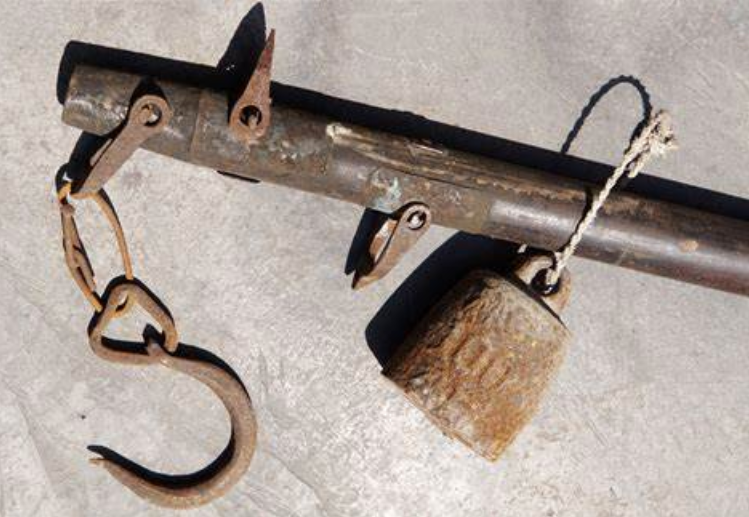
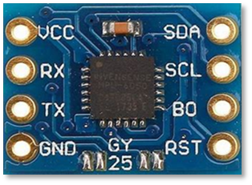
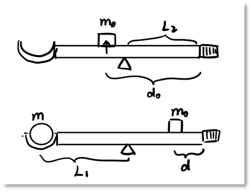
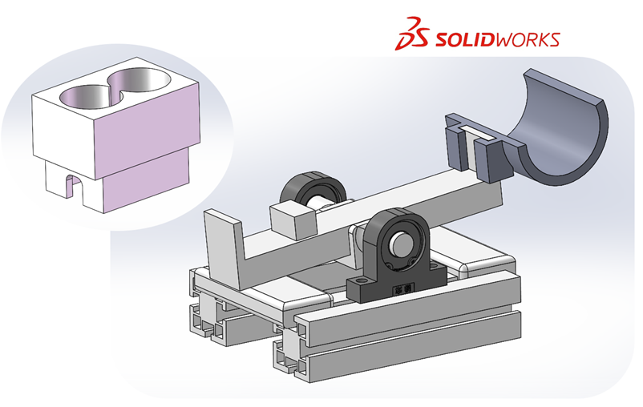
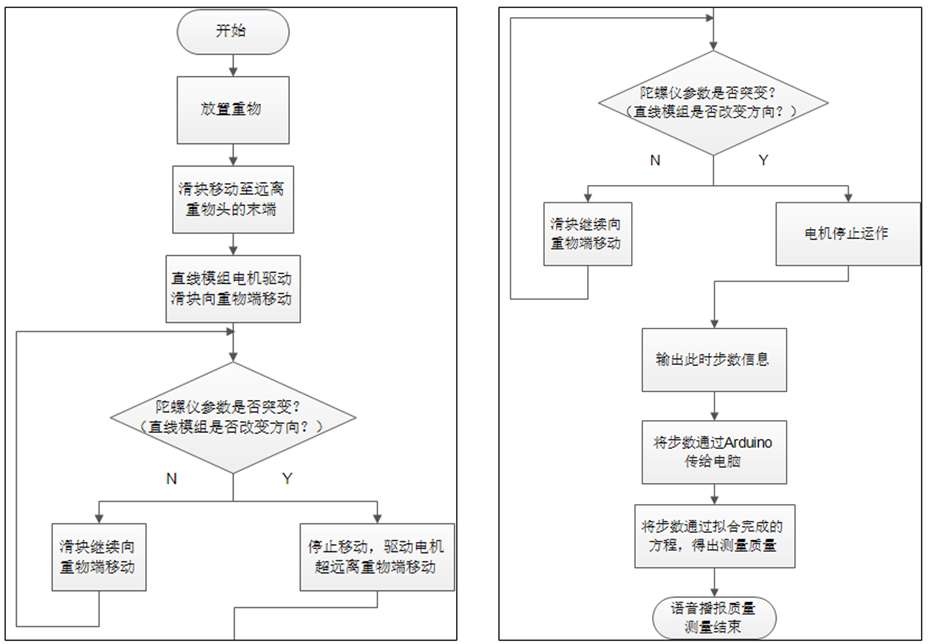
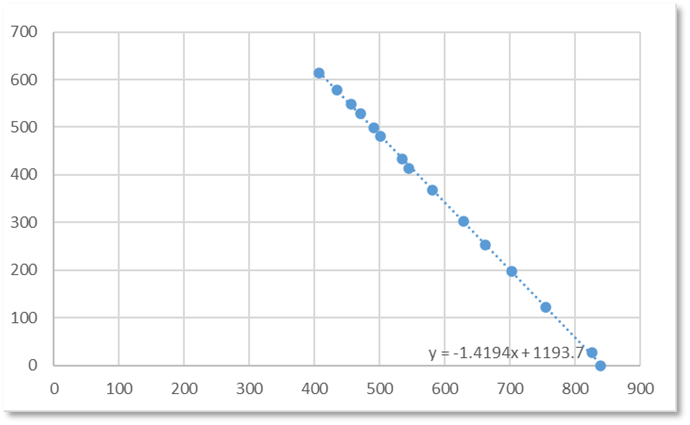
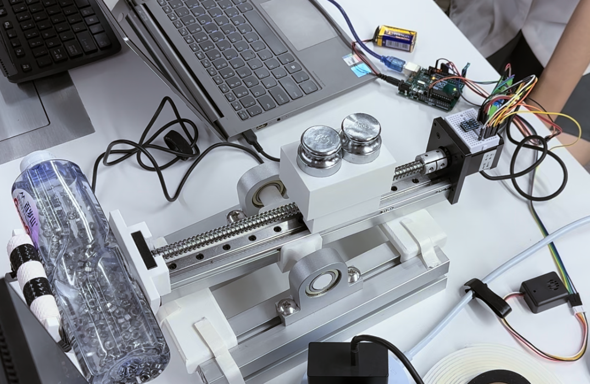

# SDM273-Lever-Weighing

### Intro

Meow~

This is the project for SDM273!

🐱This project aims to use the principle of leverage, ball screw linear module and ~~gyroscope sensor MPU6050~~ (now displayed by GY25 with a MPU6050 clip on it) to measure the quality of the object. 

感谢尉进老师对本项目的 ~~大力支持~~ 在选题、设计等等方面的技术指导与热情帮助 QWQ

Thanks to Mr. Wei for his ~~strong support for this project~~ for his technical guidance and enthusiastic help in topic selection, design, etc. QWQ

------

w(ﾟДﾟ)w敲英文好累好累本喵决定用中文！

🐱是这样的喵，本课程 Proj 要求使用传感器制作一个质量测量装置（没错就是一个称）……但是又被要求传感器不能使用 **应变类**！！！哦，就是说不能用一个称做一个称……好吧，那我们就会想到常用的一些物理量的测量转换诸如……

- 弹簧形变量间接测量：形变量 → 压力 → 质量

- 阿♂基米德浮力定律：排水量 → 质量

- 电磁力……😫这是什么✌才会用的方法啊（然后真的有人用了这个（

- 运动时的势能转换：动能 → 势能 → 质量

- 杠杆定理……没错这就是本项目使用的原理👇

简单来说，就是市称（你们在菜市场见过这个么 qwq

不过，我们是自动化专业所以要让它自己动（bushi（嗯

> ※项目特色※
>
> ⚠ 本项目中，位置的获取 **并没有依靠** 传统的位置传感器，而是通过 **在程序中** 对步进电机进行 **计步**，从而获取对重的实际位置。

### 项目要求

------

#### 总体要求

> 设计一个基于Arduino UNO与各类传感器的单物体质量测量装置，在不使用应变类传感器的限制下，尽可能精确地测得量程范围约为 75g ~ 750g 的物体的实际质量。

#### 具体要求

> （1）需使用传感器（不可使用应变类传感器）；
>
> （2）量程范围：约为 75g ~ 750g；
>
> （3）含有滤波处理。

### 称重原理

------

#### 杠杆的实现——机械架构

以直线模组为杠杆，杠杆支点与支架相连，可自由转动。重物与托盘放置在模组电机一端，模组滑块上固定已知质量的对重。法兰轴承座用以减少在旋转过程中的摩擦阻力，以减少误差，提高系统线性化程度。通过驱动步进电机，控制滑块及其上对重位移，以改变此侧的力矩，进而由杠杆原理得出待测重物质量。

A linear module is used as a lever, and the lever pivot point is connected to a support that can be freely rotated. Flange housing bearings are used to minimize the friction generated during rotation. The weight and pallet are placed at one end of the module, and a counterweight of known mass is fixed on the module slider. The mass of the weight is measured by driving a stepper motor that controls the slider and the displacement of the counterweight on it to change the torque on this side.

#### 平衡态感知——陀螺仪姿态解算

杠杆上固定有GY25陀螺仪，实时检测杠杆与水平仪的夹角。

A GY25 gyroscope is fixed on the lever to detect the angle between the lever and the level in real time. By the positive or negative angle, you can judge which end of the lever is heavier.

#### 模型建立！

根据理论构建，建模如下：（详细介绍可以看仓库里的 `./Report_null` 文件

According to the above theory, the model is established as follows:

图中各变量含义如下表：

The meaning of each variable in the figure is as follows:

| 物理量 | 含义                   |
| ------ | ---------------------- |
| $m_0$  | 滑块与对重的总质量     |
| $d_0$  | 无重物平衡时滑块的位置 |
| $M$    | 杠杆本身质量           |
| $L_1$  | 重物质心到支点的距离   |
| $L_2$  | 杠杆重心到支点的距离   |
| $m$    | 待测物质量             |
| $d$    | 有重物平衡时滑块的位置 |

所以有：

未放待测重物时，杠杆平衡关系

$$ m_0(d_0-L_2)=L_2M$$

放置待测重物时，杠杆平衡关系

$$ mL_1=L_2M+m_0(d_0-d) $$

联立得到质量与滑块位置关系为

$$ mL_1=m_0(d_0-d) $$

该理想模型为线性模型。

So we can get:

When the weight to be measured is not placed, the lever balance relationship is as follows:

$$ m_0(d_0-L_2)=L_2M$$

When placing the weight to be tested, the lever balance relationship:

$$ mL_1=L_2M+m_0(d_0-d) $$

Simultaneously obtain the relationship between mass and slider position:

$$ mL_1=m_0(d_0-d) $$

The ideal model is a linear model.

> 测量方法的改进详见 `./Report_null` 

### 总体设计

------

#### 硬件设计

整个项目仪器以直线模组为核心部件，以直线模组支架、轴承架、铝型材、砝码座、称重支架等零部件为辅助，形成一个能够实现杠杆平衡称重的整体结构。

直线模组通过直线模组支架和轴承相连，轴承固定在铝型材上，使得直线模组能够以支架为轴，实现杠杆的轻微旋转。直线模组上的滑块连接砝码架，上面放置两个500g砝码，砝码架和物块一起移动，实现平衡杠杆的目的。直线模组的另一头和重物支架相连。

除基本结构以外，在两块铝型材中间增添固定部件，限制两块铝型材支架之间的相对位置，同时限制直线模组的摆角大小，以达更快的平衡。

The entire project instrument takes the linear module as the core component, and is assisted by linear module brackets, bearing frames, aluminum profiles, weight seats, weighing brackets and other components to form an overall structure that can achieve lever balance weighing.

The linear module is connected to the bearing through the linear module bracket, and the bearing is fixed on the aluminum profile, so that the linear module can use the bracket as the axis to realize the slight rotation of the lever. The slider on the linear module is connected to the weight rack, and two 500g weights are placed on it, and the weight rack and the object move together to achieve the purpose of balancing the lever. The other end of the linear module is connected with the weight support.

In addition to the basic structure, a fixed part is added between the two aluminum profiles to limit the relative position between the two aluminum profile brackets, and at the same time limit the swing angle of the linear module to achieve faster balance.

装配体和砝码座的 `Solidworks` 建模效果如图所示：

The `Solidworks` modeling effect of the assembly and the weight seat is shown in the figure:

#### 软件设计

质量测量逻辑实现流程图如下：

The implementation logic flow chart of the quality measurement system is as follows:

### 数据标定

------

在测量支架上放置不同质量的待测物品，执行程序可得到Arduino传输给电脑的步数信息。将待测物品的质量和得到的步数信息通过Excel进行直线拟合，可以得到步数信息相对于待测物品质量的一次拟合方程。此后测量时，将未知质量物品对应的步数信息代入一次拟合方程，经计算即可得到待测物品的质量测量值。

Place the objects to be tested with different qualities on the measuring bracket and execute the program to get the step number information transmitted by Arduino to the computer. The quality of the item to be tested and the obtained step number information are fitted by a straight line through Excel, and the first-order fitting equation of the step number information relative to the quality of the item to be tested can be obtained. In the subsequent measurement, the step number information corresponding to the unknown quality item is substituted into the first-order fitting equation, and the quality measurement value of the item to be tested can be obtained through calculation.

线性回归拟合结果如下：

According to the principle of least squares linear regression, make a scatter plot and fit:

### 结论及分析

------

- 项目实体成果演示详见：[]

- 答辩现场图：

#### 误差分析

1. 步进电机细分精确度较低、电压失调、电流增益引起的误差，容易造成滑块与砝码前进步数与距离不能准确一一对应。
2. 陀螺仪测量时延迟、抖动产生的误差。
3. 测量物主要部分是液体，质心会随着装置的抖动而抖动，可能产生误差。
4. 测量数据样本较小，线性方程欠拟合/过拟合而产生误差。

#### 问题与改进

1. 六轴 MPU6050 数据抖动：引进卡尔曼滤波器（但是会带来较大的时延……

2. 原始角加速度数据零点漂移：GY25 姿态数据融合（新增一个 MCU 帮俺做！

3. 量程较小：调整对重质量，改良系统结构

4. 轴承摩擦力阻碍精确平衡：调整机械结构和算法

5. UNO 板引脚资源不足：编程进行软串口通信（软串口很好用！

6. 板卡内存占用溢出：Soft Uart 与 Hard Uart 结合（值得注意的是，硬串口由于被用于 Arduino 的程序下载，因而在“上传”时应避免引脚占用，而软串口则没有这一烦恼；不过，软串口会占用板卡的运算资源，当算不动的时候（比如这个项目中步进电机一动程序就宕机（步进电机的操作实质上就是给驱动板发送脉冲信号 就需要另外想办法比如不得不用硬串口以及……

   > 我会说我们的生草语音是因为算力不够开 OLED 可可爱爱小屏幕了吗？（x

> 以上都懒得翻译（bushi
>
> 项目中使用的 I2C UART 通讯，以及步进电机等默认大家都会（bushi，请注意步进电机的接线等……
